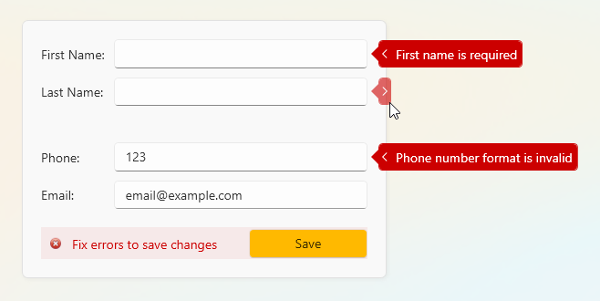

# Edit Forms - Validation UX Best Practices

This repo supports the content from my YouTube video: 

To learn how to create a persistent popup with a validation error, refer to the following files:
- [PersistentErrorPopupView.xaml](EditFormValidationWpf/Views/PersistentErrorPopupView.xaml)
- [ValidationCollout.xaml](EditFormValidationWpf/Common/ValidationCollout.xaml)

